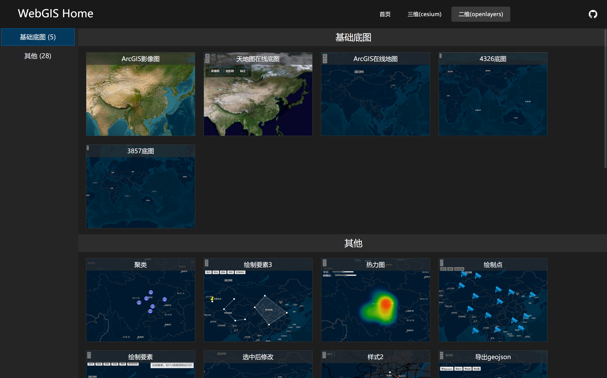
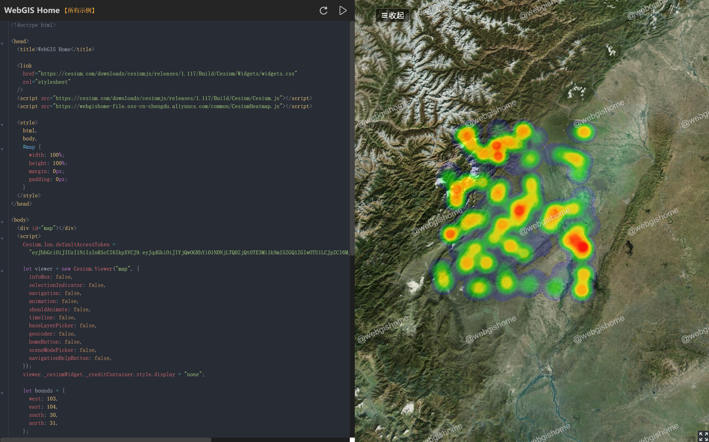

# 基于 Cesium & OpenLayers 的 WebGIS 示例集合

<p align="center">
  <strong>所有二三维示例均采用原生HTML实现，粘贴即可运行</strong>
</p>

<p align="center">
  <a href="https://vuejs.org/">
    
  </a>
  <a href="https://cesium.com/">
    
  </a>
  <a href="https://openlayers.org/">
    
  </a>
</p>

<p align="center">
  <strong>❤️ 喜欢这个项目？点个 Star 支持一下吧⭐，您的 Star 是我持续更新的最大动力～ ❤️</strong>
</p>

## 🛠️ 技术栈

- **Vue 3.5 + TypeScript** - 前端框架
- **Vite** - 构建工具
- **Cesium 1.117** - 三维地图
- **OpenLayers 7.x** - 二维地图
- **Element Plus** - UI 组件
- **CodeMirror 6** - 代码编辑器
- **Pinia + Vue Router 5** - 状态管理 & 路由

## 📸 项目截图

<div align="center">
  
  
</div>
<div align="center">
  
  
</div>

## ⚡ 快速开始

### 安装与运行

```bash
# 1️⃣ 克隆项目
git clone https://github.com/LiJiangJiangJiangJiang/cesium-examples-webgishome.git

# 2️⃣ 进入项目目录
cd cesium-examples-webgishome

# 3️⃣ 安装依赖
npm install

# 4️⃣ 启动开发服务器
npm run dev
```

### 其他命令

```bash
# 构建生产版本
npm run build

# 预览构建结果
npm run preview
```

## 🔧 配置说明

### 环境变量

项目通过 `.env` 文件配置基础路径，支持不同环境使用不同的配置：

```bash
# .env（通用配置）
VITE_BASE_URL=/

# .env.production（生产环境，部署到子目录时需要修改）
VITE_BASE_URL=/cesium-examples-webgishome/
```

---

<p align="center">Made with ❤️ by WebGIS Home</p>
<!-- <p align="center">
  <a href="#top">↑ 回到顶部 ↑</a>
</p> -->
